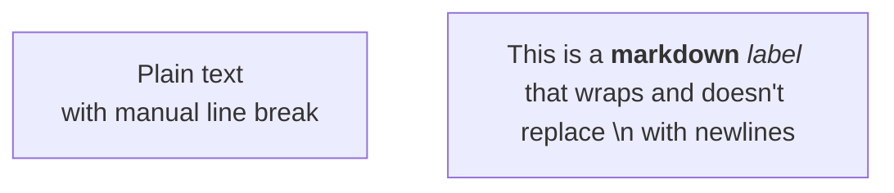

fix: Restore proper rendering of plain text flowchart labels without auto line-wrapping

This fix restores backwards compatibility with Mermaid v10 by ensuring that plain text labels in flowcharts are rendered correctly. In Mermaid v11, all labels were incorrectly being treated as markdown by default, which caused issues with text wrapping, multiline breaks, and backwards compatibility.

**What changed:**

- Plain text labels in flowcharts (without markdown syntax) now render as regular text
  - For node labels and edge labels, these will line-wrap automatically. Although this isn't backwards compatible with v10, we think this is a minor change and it's worth keeping to avoid too many changes from diagrams created from v11 onwards.
  - Plain text labels in other diagrams will continue to not line wrap.
- Plain text labels with `\n` characters now correctly create line breaks
- Plain text that looks like markdown (e.g., "1.", "- x") is no longer misinterpreted

**If you want markdown formatting:**
You can still use markdown in your flowchart labels by using the proper markdown syntax. Wrap your markdown text with double quotes and backticks:
``node["`_markdown_ **text**`"]``

Example:

````markdown

````
