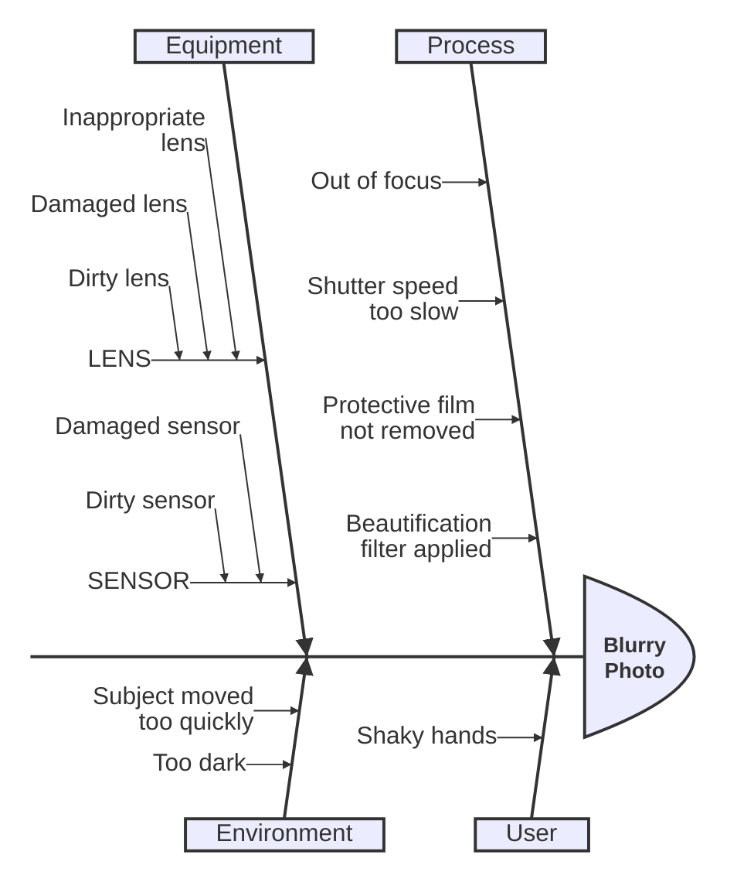

> **Warning**
>
> ## THIS IS AN AUTOGENERATED FILE. DO NOT EDIT.
>
> ## Please edit the corresponding file in [/packages/mermaid/src/docs/syntax/ishikawa.md](../../packages/mermaid/src/docs/syntax/ishikawa.md).

# Ishikawa diagram

Ishikawa diagrams are used to represent causes of a specific event (or a problem).
They are also known as fishbone diagrams, herringbone diagrams or cause-and-effect diagrams.
The diagram resembles a fish skeleton, with the main problem at the head and the causes branching off from the spine.

> **Warning**
> This is a new diagram type in Mermaid. Its syntax may evolve in future versions.

## Syntax

- The first line is the event (problem) of the diagram.
- Subsequent lines are causes of the event.
- "Fishbone" structure is indicated by indentation.
