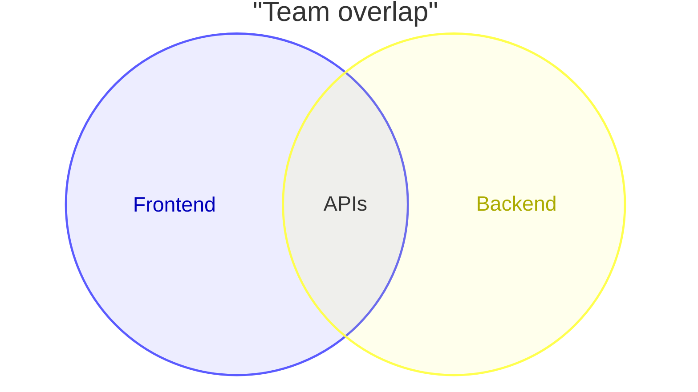
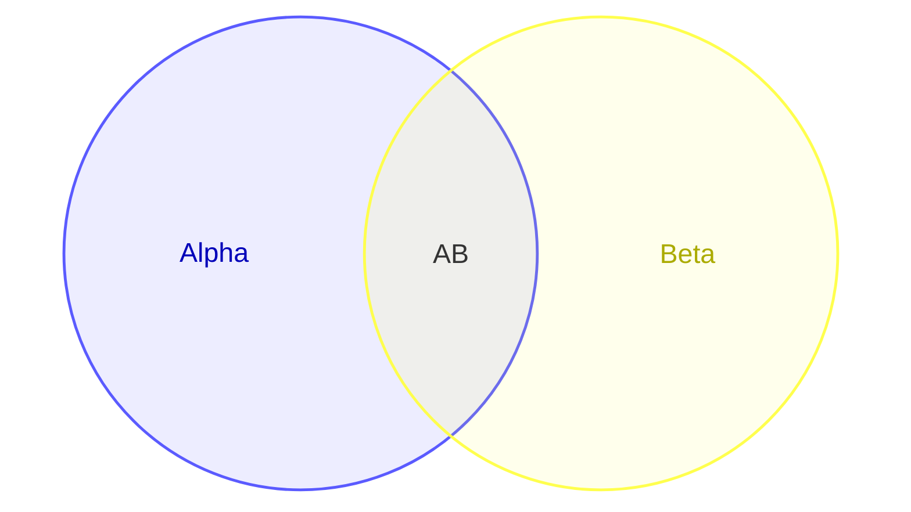
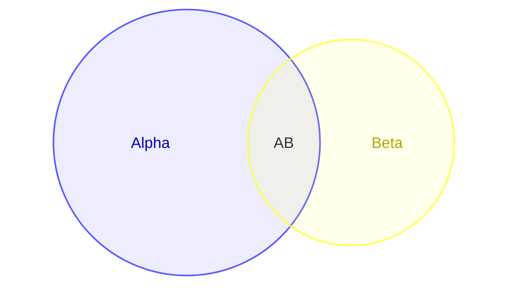
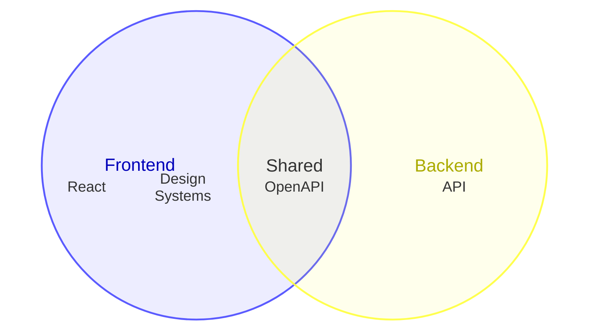
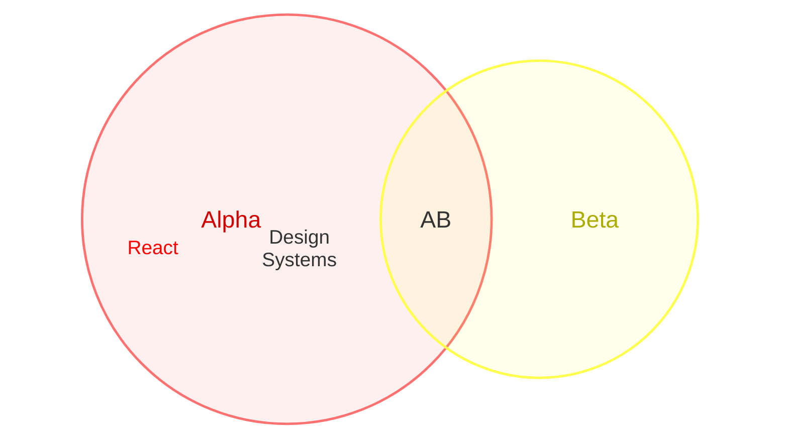

> **Warning**
>
> ## THIS IS AN AUTOGENERATED FILE. DO NOT EDIT.
>
> ## Please edit the corresponding file in [/packages/mermaid/src/docs/syntax/venn.md](../../packages/mermaid/src/docs/syntax/venn.md).

> **Warning**
>
> ## THIS IS AN AUTOGENERATED FILE. DO NOT EDIT.
>
> ## Please edit the corresponding file in [/packages/mermaid/src/docs/syntax/venn.md](../../packages/mermaid/src/docs/syntax/venn.md).

# Venn diagrams (v\<MERMAID_RELEASE_VERSION>+)

Venn diagrams show relationships between sets using overlapping circles.

> **Warning**
> This is a new diagram type in Mermaid. Its syntax may evolve in future versions.

## Syntax

- Start with `venn-beta`.
- Use `set` for a single set name.
- Use `union` for an overlap of two or more set names.
- Identifiers in `union` must be defined by earlier `set` lines.
- Set identifiers can be bare words (`A`, `Set_1`) or quoted strings (`"Foo Bar"`).

### Labels

Use bracket syntax `["..."]` to set a display label while keeping the identifier short:

### Sizes

Use `:N` suffix to set the size of a set or union:

### Text nodes

- Use `text` to place labels inside a set or union.
- Indented `text` lines attach to the most recent `set` or `union`.
- Use bracket syntax `["..."]` to set a display label for text nodes.

### Styling

Use `style` statements to apply visual styles to sets, unions, and text nodes:

- `fill`: change the fill color
- `color`: change the text color
- `stroke`: change the stroke color
- `stroke-width`: change the stroke width
- `fill-opacity`: change the fill opacity

